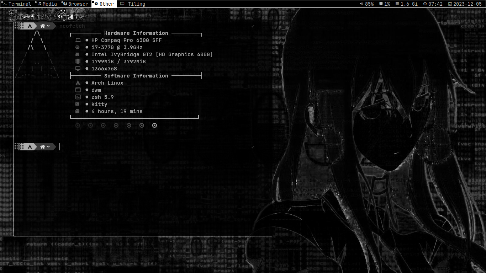
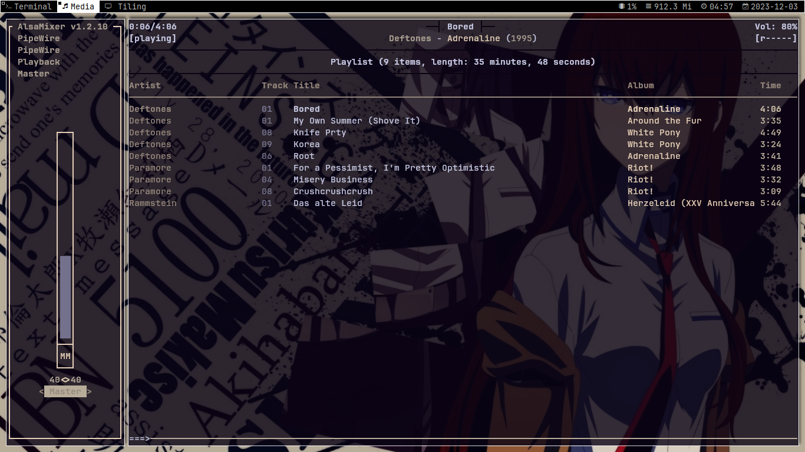

# My own fork of dwm!

- No Title
- Hide Vacant Tags
- Cool Autostart
- Border Bar
- And much more!

# Fonts
1. JetBrains Mono
2. Symbols Nerd Fonts (for the slstatus)

# Installation

1. Clone this repository with `git clone https://github.com/MaccaAlbarn/ALBRN-dwm.git`
2. Go inside the folder `cd DWM/dwm-ALBrN-build`
3. install with either `sudo make clean install` or `sudo make install`
4. go inside the folder "DWM/slstatus-1.0" `cd DWM/slstatus-1.0` and do `sudo make clean install` or `sudo make install`
5. Restart your wm/de
6. Enjoy!

(I highly suggest you install pywal 👍)

# Keybindings

- Super + Shift + Enter = Launch kitty (edit the `config.def.h` file to use your favorite terminal)
- Super + Shift + D = Launch Dmenu (you'll need my build of dmenu or use yours, again, edit the `config.def.h` file to your liking)
- Super + Shift + C = Exit dwm
- Super + Shift + Q = Close a window

# Screenshots

